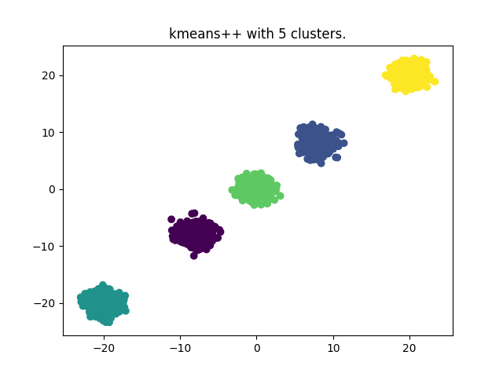
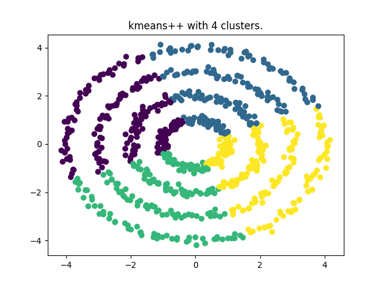
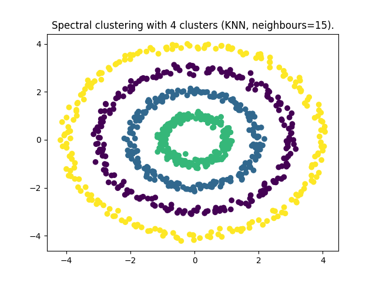

# K-means++
Classic [K-means](https://en.wikipedia.org/wiki/K-means_clustering) algorithm with [K-means++](http://en.wikipedia.org/wiki/K-means%2B%2B) for initialization.

# Spectral clustering
The implementation of [spectral clustering](https://en.wikipedia.org/wiki/Spectral_clustering) supports both [KNN](https://en.wikipedia.org/wiki/K-nearest_neighbors_algorithm) and a gaussian kernel function.

Implementation:

1. Calculate the distance matrix S (using euclidean distances).
2. Move from distances S to similarities W (using the Gaussian kernel or the nearest neighbors).
3. Calculate the diagonal degree D matrix: `D_i,i = Σ W_i,j`.
4. Create the Laplacian matrix L.
5. Decompose L into its eigenvectors and select only the ones corresponding to the k lowest eigenvalues.
6. Project the rows of the k eigenvectors onto the unit sphere (normalize the rows, where the columns are the eigenvectors).
7. Run k-means on the rows of the representation and return the clustering (row i corresponds to the original xi).

# Evaluation
I created two synthetic datasets, the first one contains 5 blobs separated one from the another and the second one is four circles.

I started by running K-means on the 5 blobs, and as we can see, K-means, as expected, was able to put each blob in a separate cluster

When we try running K-means on the four circles, it fails to cluster them

However, when using spectral clustering with KNN with k=15 we succeed in clustering the data

